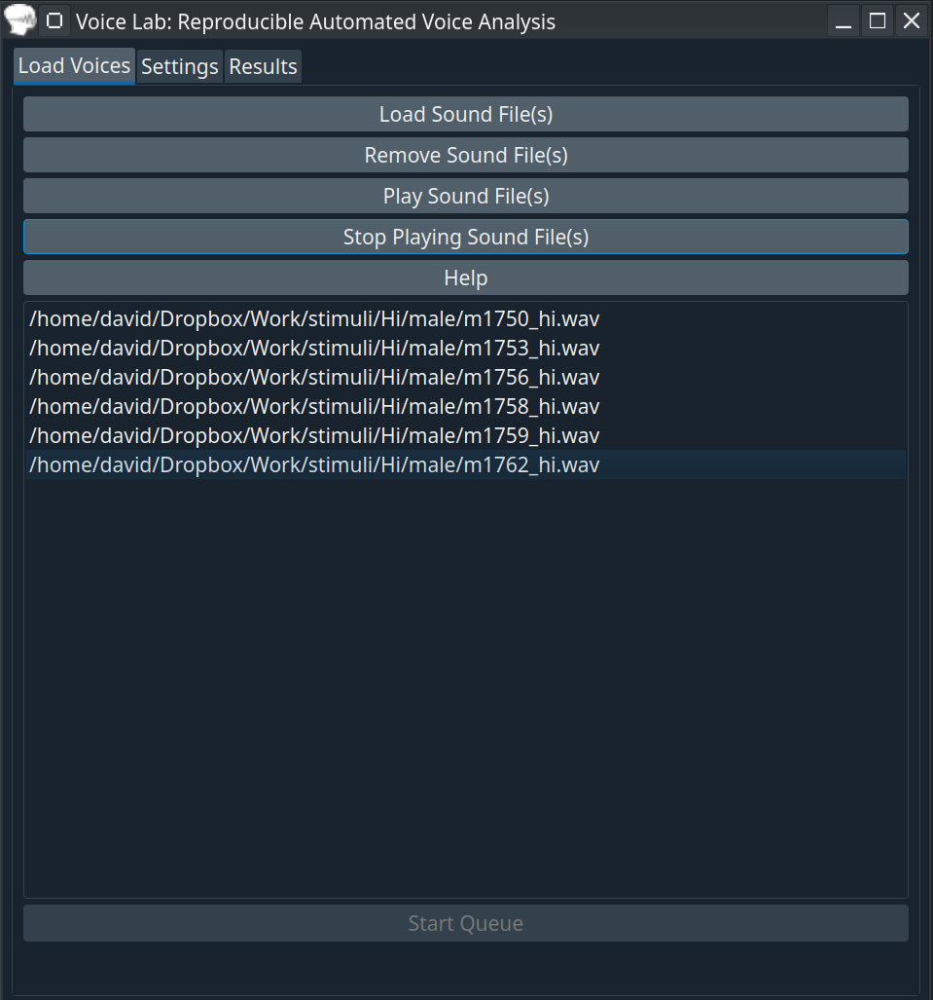
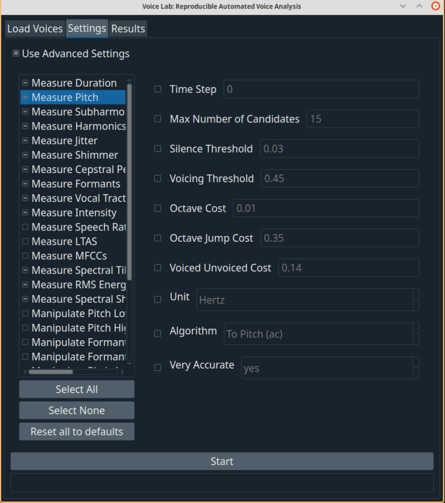
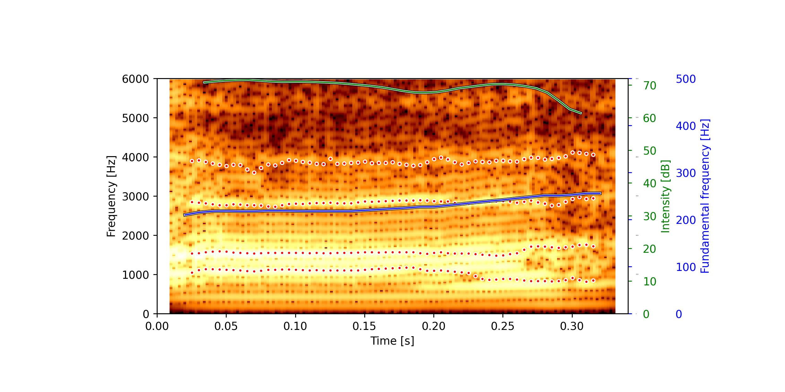
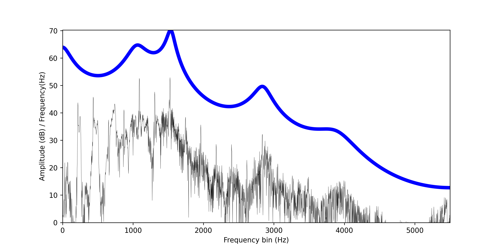
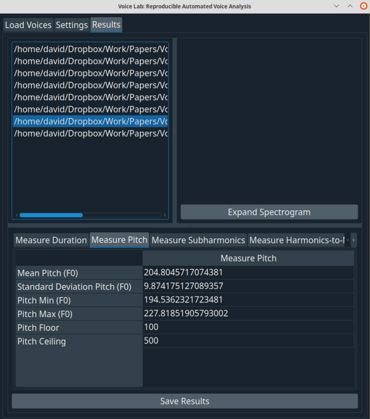

**VoiceLab**
======
**Automated Reproducible Acoustical Analysis**  
Voice Lab is an automated voice analysis software. What this software
does is allow you to measure, manipulate, and visualize many voices at
once, without messing with analysis parameters. You can also save all of
your data, analysis parameters, manipulated voices, and full colour
spectrograms and power spectra, with the press of one button.

## Contributors
### Current Contributor
David Feinberg, PhD
### Past Contributor(s)
Oliver Cook

## Version 
* Version 1.0
* This is a stable release, no longer in beta.
* Unstable features have been removed

## Contact
#### David Feinberg: feinberg@mcmaster.ca

## Installation instructions:
You can grab the full program here for <a href="https://github.com/Voice-Lab/VoiceLab/releases/download/v1.0.1/VoiceLab.zip" title="VoiceLab for OSX">OSX</a>, and <a href="https://github.com/Voice-Lab/VoiceLab/releases/download/v1.0.1/voicelab.exe" title="VoiceLab for Windows">here for Windows</a>.  On OSX, don't forget to unzip the files. Then just run the VoiceLab file --no installation necessary.

### If you are on Linux, other systems, or just want to use Python, we recommend setting up a new virtual environment with Python 3.9.
0. Clone this repository and navigate to the project root.
1. <code>python3.9 -m venv venv</code>
2. <code>source venv/bin/activate</code>
3. <code>python setup.py install</code>
4. <code>python voicelab.py</code>

 # Documentation
 https://voice-lab.github.io/VoiceLab

Voice Lab
=========

Voice Lab is written in Python and relies heavily on a package called
parselmouth-praat. parselmouth-praat is a Python package that
essentially turns Praat\'s source code written in C and C++ into a
Pythonic interface. What that means is that any praat measurement in
this software is using actual Praat source code, so you can trust the
underlying algorithms. Voice Lab figures out all of the analysis
parameters for you, but you can always use your own, and these are the
same parameters as in Praat, and they do the exact same thing because it
is Praat\'s source code powering everything. That means if you are a
beginner an expert, or anything in-between, you can use this software to
automate your acoustical analyses.

All of the code is open source and available on our GitHub repository,
so if this manual isn\'t in-depth enough, and you want to see exactly
what\'s going on, go for it. It is under the MIT license, so you are
free to do what you like with the software as long as you give us
credit. For more info on that license, see here.

Load Voices Tab
===============

Load Sound File
---------------

Press this button to load sound files. You can load as many files as you
like. At the moment, Voice Lab processes the following file types:

-   wav
-   mp3
-   aiff
-   ogg
-   aifc
-   au
-   nist
-   flac

Remove Sound File
-----------------

Use this button to remove the selected sound file(s) from the list.

Start
-----

Pressing this begins analysis. If you want to run the default analysis,
press this button. If you want to select different analyses or adjust
analysis parameters, go to the \'Settings\' tab and press the \'Advanced
Settings\' button. Only the files selected (in blue) will be analyzed.
By default we will select all files.

Settings Tab
============

To choose different analyses, select the `Use Advanced Settings`{.python
.sourceCode} checkbox. From here, you\'ll be given the option to select
different analyses. You can also change any analysis parameters. If you
do change analysis parameters, make sure you know what you are doing,
and remember that those same analysis parameters will be used on all
voice files that are selected. If you don\'t alter these parameters, we
determine analysis parameters automatically for you, so they are
tailored for each voice to give the best measurements.

Save Results
------------

Save Results saves two xlsx files. One is the results.xlsx file and one
is the settings.xlsx file. Here you can choose the directory you want to
save the files into. You don\'t have to click on a file, just go to the
directory and press the button.

### results.xlsx

The results file saves all of the voice measurements that you made. Each
measurement gets a separate tab in the xlsx file.

### settings.xlsx

This file saves all of the parameters used in each measurement. Each
measurement gets a separate tab in the xlsx file. This is great if you
want to know what happened. It can also accompany a manuscript or paper
to help others replicate analyses.

Measure Duration
----------------

This measures the full duration of the sound file. There are no
parameters to adjust.

Measure Pitch 
-------------

This measures voice pitch or fundamental frequency. This uses Praat\'s
`Sound: To Pitch (ac)...`, by default. You can also
use the cross-correlation algorithm: `Sound: To Pitch (cc)...`{.python
.sourceCode}. For full details on these algorithms, see the [praat
manual pitch page](http://www.fon.hum.uva.nl/praat/manual/Pitch.html).
`Measure Pitch` returns the following measurements:
- Minimum Pitch  
- Maximum Pitch  
- Mean Pitch  
- Standard Deviation of Pitch  
- Pitch Floor  
- Pitch Ceiling  

We use the automated pitch floor and ceiling parameters described
`here.<floor-ceiling>`

Measure Subharmonics
--------------------

This measures subharmonic pitch and subharmonic to harmonic ratio.
Subharmonic to harmonic ratio and Subharmonic pitch are measures from
Open Sauce (Yu et al., 2019), a Python port of Voice Sauce (Shue et al.,
2011). These measurements do not use any Praat or Parselmouth code. As
in (Shue et al., 2011) and (Yu et al., 2019), subharmonic raw values are
padded with NaN values to 201 data points.

- Shue, Y.-L., Keating, P., Vicenik, C., & Yu, K. (2011). VoiceSauce: A program for voice analysis. Proceedings of the ICPhS XVII, 1846–1849.  
- Yu, T. M., Murray, R. D., Silverstein, K., & Yu, K. M. (2019). OpenSauce: Open source software for voice analysis, v0.1. https://doi.org/10.5281/zenodo.2638411

### Automated pitch floor and ceiling parameters 

Praat suggests adjusting pitch settings based on
[gender](http://www.fon.hum.uva.nl/praat/manual/Intro_4_2__Configuring_the_pitch_contour.html)
. It\'s not gender per se that is important, but the pitch of voice. To
mitigate this, VoiceLab first casts a wide net in floor and ceiling
settings to learn the range of probable fundamental frequencies is a
voice. Then it remeasures the voice pitch using different settings for
higher and lower pitched voices. VoiceLab by default uses employs
`very accurate`. VoiceLab returns
`minimum pitch`, `maximum pitch`{.python
.sourceCode}, `mean pitch`, and
`standard deviation of pitch`. By default VoiceLab
uses autocorrelation for `Measuring Pitch<Pitch>`{.interpreted-text
role="ref"}, and cross-correlation for
`harmonicity<HNR>`,
`Jitter<Jitter>`, and
`Shimmer<Shimmer>`,

Measure Harmonicity 
-------------------

This measures mean harmonics-to-noise-ratio using automatic floor and
ceiling settings described `here.<floor-ceiling>`{.interpreted-text
role="ref"} Full details of the algorithm can be found in the [Praat
Manual Harmonicity
Page](http://www.fon.hum.uva.nl/praat/manual/Harmonicity.html). By
default Voice Lab use `To Harmonicity (cc)..`. You
can select `To Harmonicity (ac)` or change any
other Praat parameters if you wish.

Measure Jitter 
--------------

This measures and returns values of all of [Praat\'s jitter
algorithms](http://www.fon.hum.uva.nl/praat/manual/Voice_2__Jitter.html).
This can be a bit overwhelming or difficult to understand which measure
to use and why, or can lead to multiple colinear comparisons. To address
this, by default, Voice Lab returns a the first component from a
principal components analysis of those jitter algorithms taken across
all selected voices. The underlying reasoning here is that each of these
algorithms measures something about how noisy the voice is due to
perturbations in period length. The PCA finds what is common about all
of these measures of noise, and gives you a score relative to your
sample. With a large enough sample, the PCA score should be a more
robust measure of jitter than any single measurement. Voice Lab uses use
it's `automated pitch floor and ceiling algorithm.<floor-ceiling>` to set analysis parameters.

Jitter Measures:

-   Jitter (local)
-   Jitter (local, absolute)
-   Jitter (rap)
-   Jitter (ppq5)
-   Jitter (ddp)

Measure Shimmer 
---------------

This measures and returns values of all of [Praat\'s shimmer
algorithms](http://www.fon.hum.uva.nl/praat/manual/Voice_3__Shimmer.html).
This can be a bit overwhelming or difficult to understand which measure
to use and why, or can lead to multiple colinear comparisons. To address
this, by default, Voice Lab returns a the first component from a
principal components analysis of those shimmer algorithms taken across
all selected voices. The underlying reasoning here is that each of these
algorithms measures something about how noisy the voice is due to
perturbations in amplitude of periods. The PCA finds what is common
about all of these measures of noise, and gives you a score relative to
your sample. With a large enough sample, the PCA score should be a more
robust measure of shimmer than any single measurement. Voice Lab uses
use it's `automated pitch floor and ceiling algorithm.<floor-ceiling>` to set analysis parameters.

Shimmer Measures:

-   Shimmer (local)
-   Shimmer (local, dB)
-   Shimmer (apq3)
-   Shimmer (aqp5)
-   Shimmer (apq11)
-   Shimmer (ddp)

Measure Cepstral Peak Prominance (CPP)
--------------------------------------

This measures Cepstral Peak Prominance in Praat. You can adjust
interpolation, qeufrency upper and lower bounds, line type, and fit
method.

Measure Formants
----------------

This returns the mean of the first 4 formant frequencies of the voice
using the `To FormantPath` algorithm using 5.5
maximum number of formants. All other values are Praat defaults for
Formant Path. Formant path picks the best formant ceiling value by
fitting each prediction to a polynomial curve, and choosing the best fit
for each formant. You can also use your own settings for :python:\'To
Formant Burg\...\' if you want to.

Vocal Tract Estimates
---------------------

This returns the following vocal tract length estimates:

### Average Formant

This calculates the mean  of the first
four formant frequencies for each sound.

Pisanski, K., & Rendall, D. (2011). The prioritization of voice
fundamental frequency or formants in listeners' assessments of speaker
size, masculinity, and attractiveness. The Journal of the Acoustical
Society of America, 129(4), 2201-2212.

### Principle Components Analysis

This returns the first factor from a Principle Components Analysis (PCA)
of the 4 formants.

Babel, M., McGuire, G., & King, J. (2014). Towards a more nuanced view
of vocal attractiveness. PloS one, 9(2), e88616.

### Formant Position

Formant Position is set to only run on samples of 30 or greater because
this measure is based on transforming the data using z-scoring, which is
based on the population mean. Without a large enough sample, this
measurement could be suspicious.

Puts, D. A., Apicella, C. L., & Cárdenas, R. A. (2011). Masculine voices
signal men's threat potential in forager and industrial societies.
Proceedings of the Royal Society B: Biological Sciences, 279(1728),
601-609.

### Geometric Mean

This calculates the geometric mean
 of the first 4 formant frequencies for each sound.

Smith, D. R., & Patterson, R. D. (2005). The interaction of
glottal-pulse rate andvocal-tract length in judgements of speaker size,
sex, and age.Journal of the Acoustical Society of America, 118,
3177e3186.

### Formant Dispersion

Fitch, W. T. (1997). Vocal-tract length and formant frequency dispersion
correlate with body size in rhesus macaques.Journal of the Acoustical
Society of America,102,1213e1222.

### VTL

Fitch, W. T. (1997). Vocal-tract length and formant frequency dispersion
correlate with body size in rhesus macaques.Journal of the Acoustical
Society of America,102,1213e1222.

Titze, I. R. (1994).Principles of voice production. Englewood Cliffs,
NJ: Prentice Hall.

### VTL Δf

 = The slope of 0 intercept regression between
F_i = \frac{(2i-1)}{2}\Delta f and the mean of each of the first 4 formant
frequencies.

Reby,D.,& McComb,K.(2003).Anatomical constraints generate honesty:
acoustic cues to age and weight in the roars of red deer stags. Animal
Behaviour, 65,519e530.

Measure Intensity
-----------------

This returns the mean of Praat\'s `Sound: To Intensity...` function in dB. You can adjust the minimum pitch parameter.

Measure RMS Energy
------------------

This returns RMS amplitude, similar to ENERGY in Voice Sauce. You can
adjust the start and end time of the analysis. If you leave both values
at 0, it will measure the entire file.

Measure Speech Rate
-------------------

This function is an implementation of the Praat script published here:
De Jong, N.H. & Wempe, T. (2009). Praat script to detect syllable nuclei
and measure speech rate automatically. Behavior research methods, 41
(2), 385 - 390.

Voice Lab used version 2 of the script, available [here
https://sites.google.com/site/speechrate/Home/praat-script-syllable-nuclei-v2]{.title-ref}

This returns: - Number of Syllables

-   Number of Pauses
-   Duratrion(s)
-   Phonation Time(s)
-   Speech Rate (Number of Syllables / Duration)
-   Articulation Rate (Number of Syllables / Phonation Time)
-   Average Syllable Duration (Speaking Time / Number of Syllables)

You can adjust: - silence threshold `mindb`

-   mimimum dip between peaks (dB) `mindip`. This
    should be between 2-4. Try 4 for clean and filtered sounds, and
    lower numbers for noisier sounds.
-   minimum pause length `minpause`

This command really only words on sounds with a few syllables, since
Voice Lab is measuring how fast someone speaks. For monosyllabic sounds,
use the `Measure Duration function.<Duration>`

Measure Spectral Tilt
---------------------

This measures spectral tilt by returning the slope of a regression
between freqeuncy and amplitude of each sound. This is from a script
written by Michael J. Owren, with sorting errors corrected. This is not
the same equation in Voice Sauce.

Owren, M.J. GSU Praat Tools: Scripts for modifying and analyzing sounds
using Praat acoustics software. Behavior Research Methods (2008) 40:
822--829. <https://doi.org/10.3758/BRM.40.3.822>

Measure LTAS:
-------------

This measures several items from the Long-Term Average Spectrum using
Praat\'s default settings.

-   mean (dB)
-   slope (dB)
-   local peak height (dB)
-   standard deviation (dB)
-   spectral tilt slope (dB/Hz)
-   spectral tilt intercept (dB)

You can adjust: - Pitch correction - Bandwidth - Max Frequency -
Shortest and longest periods - Maximum period factor

Measure Spectral Shape
----------------------

This measures spectral: - Centre of Gravity - Standard Deviation -
Kurtosis - Band Energy Difference - Band Density Difference

Voice Manipulations
===================

Voice Lab provides several voice manipulations.

Manipulate Pitch
----------------

This manipulates pitch using the PSOLA method. By default Manipulate
Pitch Lower and Manipulate Pitch Higher lower and raise pitch by -/+ 0.5
ERBs (Equivalent Rectangular Bandwidths) which is about -/+ 20 Hz at a
120 Hz pitch centre and about -/+ 25 Hz at a 240 Hz pitch centre. By
default VoiceLab also normalizes intensity to 70 dB RMS, but you can
turn this off by deselecting the box in the Settings tab.

Manipulate Formants
-------------------

This manipulates formants using Praat\'s Change Gender Function. By
default, Formants are scaled by +/- 15%. This manipulation resamples a
sound by the Formant scaling factor (which can be altered in the
Settings tab). Then, the sampling rate is overriden to the sound\'s
original sampling rate. Then PSOLA is employed to stretch time and pitch
back (separately) into their original values.

Manipulate Pitch and Formants
-----------------------------

This manipulation raises and lowers both pitch and formants in the same
direction by the same or independent amounts. This uses the algorithm
described in Manipulate Formants, but allows the user to scale or shift
pitch to a designated degree. By default, pitch is also scaled +/- 15%.

Resample Sounds
---------------

This is a quick and easy way to batch process resampling sounds. 44.1kHz
is the default. Change this value in the Settings tab.

Reverse Sounds
--------------

This reverses the selected sounds. Use this if you want to play sounds
backwards. Try a Led Zepplin or Beatles song.

Scale Intensity
---------------

This scales intensity to an RMS value. Use this if you want your sounds
to all be at an equivalent amplitude. By default intensity is normalized
to 70 dB.

Trim Sounds
-----------

This trims sounds. You can trim a % of time off the ends of the sound,
or voicelab can automatically detect silences at the beginning and end
of the sound, and clip those out also.

Spectrograms
============

VoiceLab creates full colour spectrograms. By default we use a wide-band
window. You can adjust the window length. For example, for a narrow-band
spectrogram, you can try 0.005 as a window length. You can also select a
different colour palate. You can also overlay pitch, the first four
formant frequencies, and intensity measures on the spectrogram.

Power Spectra
=============

VoiceLab creates power spectra of sounds and overlays an LPC curve over
the top.

Results Tab
===========

This is where you can view results. You can select each voice file on
the left and view each measurement result on the bottom frame. You can
also view your spectrograms in the spectrogram window. You can change
the size of any of these frames in order to see things better. Press
`Save Results` to save data. All data (results &
settings), manipulated voices, and spectrograms are saved automatically
when this button is pressed. All you have to do is choose which folder
to save into. Don\'t worry about picking file names, Voice Lab will make
those automatically for you.

### Output formats

-   All data files are saved as xlsx
-   All sound files are saved as wav
-   All image files are saved as png
